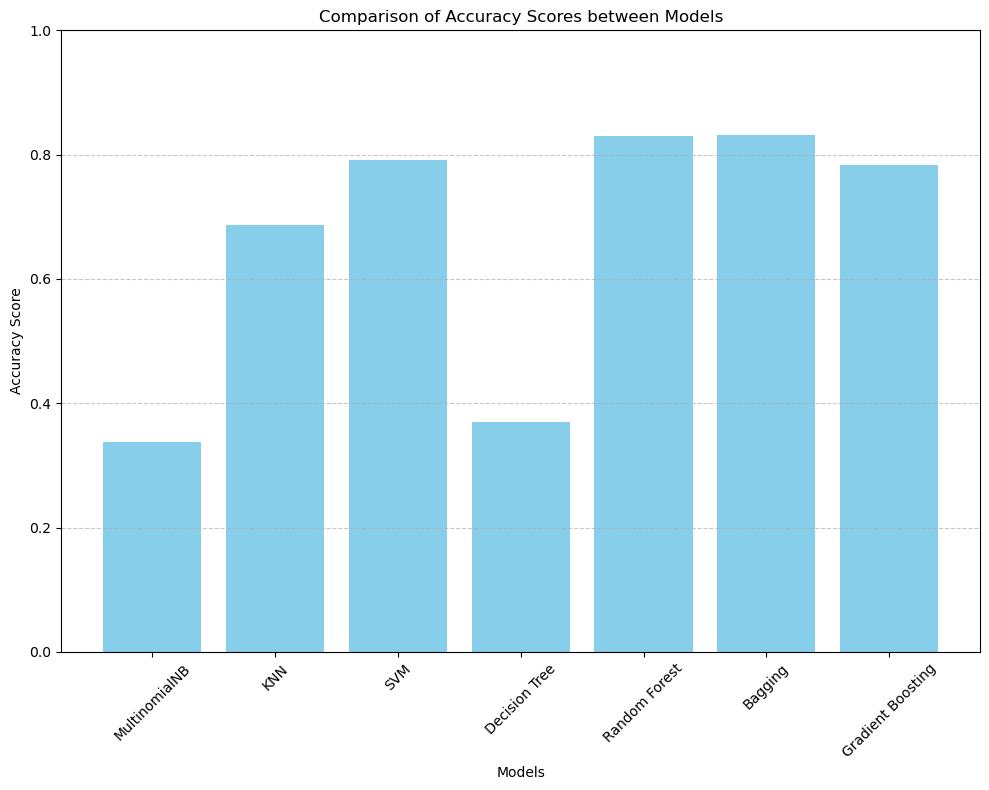
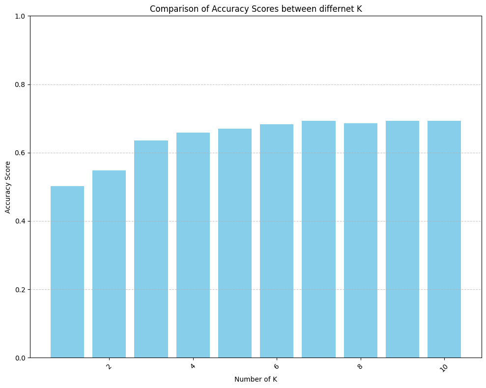
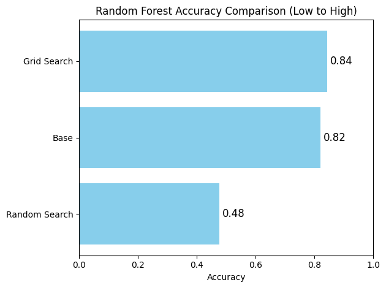

# Emotion Classification in Tweets

**Authors**: Sofía Martínez Pastor and Milan Ehret

This project aims to classify emotions in tweets using **Machine Learning** techniques. The provided dataset contains tweets labeled with one of six emotions: 0 - sadness, 1 - joy, 2 -love , 3 - anger, 4 - fear, 5 - surprise.

### Objectives

- **Emotion Classification in Text**: Train and evaluate classification models capable of detecting the emotions present in the tweets.
- **Implementation of Multiple Models**: Compare the performance of different classification algorithms.
- **Hyperparameter Tuning**: Fine-tune the models' hyperparameters to improve performance.

### Task 1 - Data preparation and exploration

We started by exploring the data.

We have some imbalance on the emotions. This can affect model performance, as models might be biased towards the most frequent classes. So it can be much more useful to evaluate additional metrics like F1-score or the confusion matrix to get a more complete view of how the model is classifying emotions, especially for underrepresented classes.

 The length of the text can affect the vectorization process. And, as we can see in the graph, most texts cluster around the 50-75 character range, with a gradual decline in frequency for longer texts. So we used TF-IDF to normalize this by down-weighting terms that appear very frequently across all documents. This normalization helps prevent overly frequent terms from dominating the model, giving better feature representations. So our texts now look like this:

 

### Models Implemented

The project includes several classification models, including:

- **KNN (K-Nearest Neighbors)**
- **SVM (Support Vector Machine)**
- **Decision Trees**
- **Random Forest**
- **Bagging**
- **Gradient Boosting**

We first compare the accuracy of the diffent models to select a few that we will imporve furhter.

## Cross validation and Hyperparameter Tuning
We will implement cross validation and Hyperparameter tuning for selected base models which already show promissing results (hight accuracy and consistent confussion matrix) so:  
**KNN**  

As we can see KNN with K = 7 produces the best results. Even better then the Base KNN Clasifier because of Cross-Valdiation.  

**Random Forest**   

Grid search produces best results because it has overview over all options and Random Search dosent find the good Options in this instance so the Result is lower than the base Classifier.

**Best parameter:**
Grid Search:

| Hyperparameter    | Best Value    |
|-------------------|---------------|
| criterion         | gini          |
| max_depth         | None          |
| min_samples_leaf  | 1             |
| max_samples_split | 30            |
| n_estimators      | 100           |

Radom Search:  {'n_estimators': 50, 'max_features': 'log2', 'max_depth': None}

| Hyperparameter    | Best Value    |
|-------------------|---------------|
| max_features      | log2          |
| max_depth         | None          |
| n_estimators      | 50            |

The main diffence is in the number of Estimators choosen so the lower score makes sense because with a lower amount of trees the Forest cant capture as many relations in the data.

**Bagging**  

